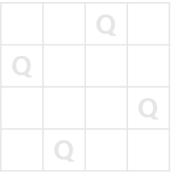

# 📚 N-Queen

## 📌 [문제링크](https://school.programmers.co.kr/learn/courses/30/lessons/12952)

### 문제 해설

- 가로, 세로 길이가 n인 정사각형으로 된 체스판이 있다.
- 체스판 위의 n개의 퀸이 서로를 공격할 수 없도록 배치하려고 한다.
- 퀸은 같은 행,열,대각선 방향으로 공격할 수 있다.
- 체스판의 길이 n이 주어지고, n개의 퀸이 조건에 만족하도록 배치될 수 있는 방법의 수를 return 하라.

### 문제 풀이



- dfs를 이용한 풀이 1 

- 코드가 지저분하다.

```
def dfs(now,n,board):
    answer = 0
    if now == n:
        #print(board)
        return 1
    
    # 놓을 자리 찾기
    for y in range(n):
        if now != 0:
            for prev in range(now): # 0 ~ now-1
                if board[prev] != y and abs( (board[prev] - y) / (prev - now) ) != 1:
                    continue
                else:
                    break
            else:
                board[now] = y
                answer += dfs(now+1,n,board[:] )
        else:
            board[now] = y
            answer += dfs(now+1,n,board[:])
    return answer
    
    
def solution(n):
    return dfs( 0, n, [0 for _ in range(n)] )
```

- dfs를 이용한 풀이 2

```
def dfs(queen, row, n):
    count = 0
    if n == row:
        return 1
    for col in range(n):
        queen[row] = col
        for i in range(row):
            if queen[i] == queen[row]:
                break
            if abs(queen[i]-queen[row]) == row - i:
                break
        else:
            count += dfs(queen, row + 1, n)
    return count
def solution(n):
    return dfs([0]*n, 0, n)
```
